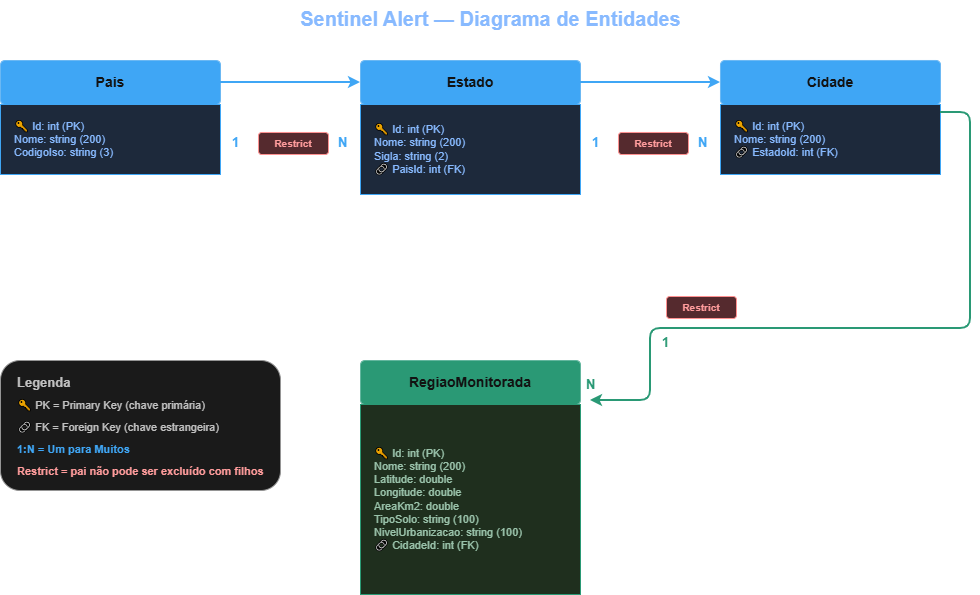

# 🌩️ Sentinel Alert — API .NET

> API REST para gerenciamento de regiões monitoradas do sistema de alertas de desastres naturais

**Grupo:** Meteo Solution  
**Disciplina:** Advanced Business Development with .NET — FIAP 2TDS  
**Global Solution 2026/1**

---

## 👥 Integrantes

| Nome | RM |
|---|---|
| Ana Carolina Pereira Fontes | RM 562145 |
| João Victor Nascimento Adão | RM 563409 |
| Johnny Dias Mathias Junior | RM 566516 |
| Luisa Ganasevici de Abreu | RM 563403 |
| Matheus Moya de Oliveira | RM 562822 |

---

## 📋 Sobre o Projeto

O **Sentinel Alert** é uma plataforma B2B2C que utiliza dados de satélite e APIs públicas (NASA EONET, CEMADEN, OpenWeatherMap) para prever riscos de desastres naturais e enviar alertas personalizados.

Esta API gerencia a hierarquia geográfica do sistema — países, estados, cidades e regiões monitoradas — que alimenta o modelo de IA para cálculo de risco.

---

## 🛠️ Stack

| Camada | Tecnologia |
|---|---|
| Framework | .NET 10, ASP.NET Core Web API |
| ORM | Entity Framework Core 10 (Code First) |
| Banco | PostgreSQL |
| Documentação | Swagger / OpenAPI |
| Arquitetura | Repository Pattern |

---

## 🏗️ Arquitetura

```
Controllers/     → recebe requisições HTTP e retorna respostas
  DTOs/          → objetos de entrada (request) e saída (response)
Models/          → entidades que representam as tabelas do banco
Repositories/    → acesso e manipulação dos dados via EF Core
Data/            → configuração do DbContext e mapeamentos
Migrations/      → histórico versionado de mudanças no banco
```

---

## 🗄️ Diagrama de Entidades



**Hierarquia geográfica:**
```
Pais (1) ──→ (N) Estado (1) ──→ (N) Cidade (1) ──→ (N) RegiaoMonitorada
```

Todos os relacionamentos usam `DeleteBehavior.Restrict` — impede exclusão de registros pai que possuem filhos vinculados, protegendo a integridade referencial.

---

## ⚙️ Como executar localmente

### Pré-requisitos

- [.NET 10 SDK](https://dotnet.microsoft.com/download)
- PostgreSQL rodando localmente
- [EF Core CLI](https://learn.microsoft.com/en-us/ef/core/cli/dotnet): `dotnet tool install --global dotnet-ef`

### Passo a passo

**1. Clone o repositório**
```bash
git clone https://github.com/FIAP-2026-GS1/meteo-solution-dotnet.git
cd meteo-solution-dotnet/MeteoSolution.API
```

**2. Configure a connection string em `appsettings.json`**
```json
{
  "ConnectionStrings": {
    "DefaultConnection": "Host=localhost;Port=5432;Database=meteosolution_db;Username=postgres;Password=sua_senha"
  }
}
```

**3. Aplique as migrations**
```bash
dotnet ef database update
```

**4. Execute a aplicação**
```bash
dotnet run
```

**5. Acesse o Swagger**
```
http://localhost:{porta}/swagger
```

---

## 🔌 Endpoints e Exemplos de Teste

> **Ordem de cadastro obrigatória:** Pais → Estado → Cidade → RegiaoMonitorada

---

### Pais

**POST /api/Pais**
```json
{
  "nome": "Brasil",
  "codigoIso": "BR"
}
```
Response `201 Created`:
```json
{
  "id": 1,
  "nome": "Brasil",
  "codigoIso": "BR"
}
```

**GET /api/Pais**
Response `200 OK`:
```json
[
  { "id": 1, "nome": "Brasil", "codigoIso": "BR" }
]
```

**GET /api/Pais/1** → Response `200 OK` com o objeto do país

**PUT /api/Pais/1**
```json
{
  "nome": "República Federativa do Brasil",
  "codigoIso": "BR"
}
```
Response `200 OK`

**DELETE /api/Pais/1** → Response `204 No Content`
> ⚠️ Retorna `400 Bad Request` se houver estados vinculados (DeleteBehavior.Restrict)

---

### Estado

**POST /api/Estado**
```json
{
  "nome": "São Paulo",
  "sigla": "SP",
  "paisId": 1
}
```
Response `201 Created`:
```json
{
  "id": 1,
  "nome": "São Paulo",
  "sigla": "SP",
  "paisId": 1,
  "paisNome": "Brasil"
}
```

**PUT /api/Estado/1**
```json
{
  "nome": "São Paulo",
  "sigla": "SP",
  "paisId": 1
}
```

**DELETE /api/Estado/1** → `204 No Content`
> ⚠️ Retorna `400 Bad Request` se houver cidades vinculadas

---

### Cidade

**POST /api/Cidade**
```json
{
  "nome": "São Paulo",
  "estadoId": 1
}
```
Response `201 Created`:
```json
{
  "id": 1,
  "nome": "São Paulo",
  "estadoId": 1,
  "estadoNome": "São Paulo"
}
```

**DELETE /api/Cidade/1** → `204 No Content`
> ⚠️ Retorna `400 Bad Request` se houver regiões vinculadas

---

### RegiaoMonitorada

**POST /api/RegiaoMonitorada**
```json
{
  "nome": "Vale do Paraíba",
  "latitude": -23.1791,
  "longitude": -45.8872,
  "areaKm2": 150.5,
  "tipoSolo": "argiloso",
  "nivelUrbanizacao": "alto",
  "cidadeId": 1
}
```
Response `201 Created`:
```json
{
  "id": 1,
  "nome": "Vale do Paraíba",
  "latitude": -23.1791,
  "longitude": -45.8872,
  "areaKm2": 150.5,
  "tipoSolo": "argiloso",
  "nivelUrbanizacao": "alto",
  "cidadeId": 1,
  "cidadeNome": "São Paulo"
}
```

---

## 📌 Decisões Técnicas

| Decisão | Justificativa |
|---|---|
| **Repository Pattern** | Isola a lógica de acesso ao banco dos Controllers — facilita manutenção e testes |
| **DTOs separados** | DTO de entrada controla o que o cliente envia. DTO de saída controla o que a API retorna — evita exposição de dados e ciclos de referência |
| **Code First + Migrations** | Banco gerado e versionado a partir das classes C# — consistência entre ambientes |
| **DeleteBehavior.Restrict** | Impede exclusão de registros pai com filhos vinculados — integridade referencial |
| **ReferenceHandler.IgnoreCycles** | Evita ciclos de serialização JSON em relacionamentos bidirecionais |
| **Swagger em todos os ambientes** | Facilita testes e demonstração sem depender de ambiente específico |
